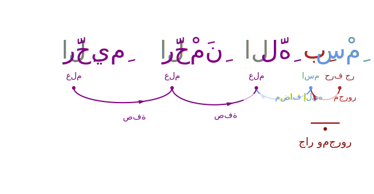
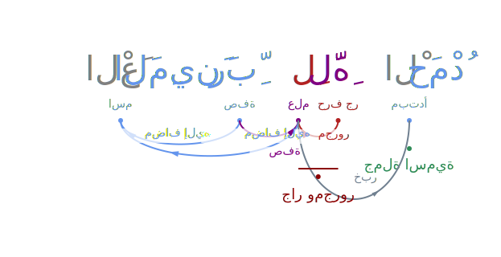
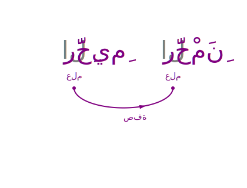
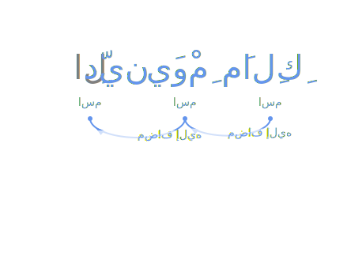
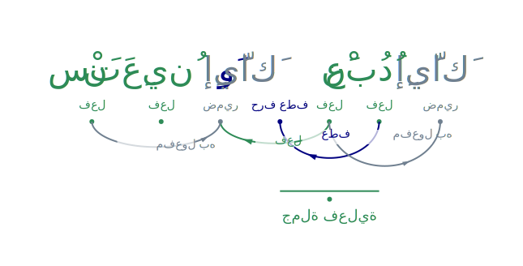
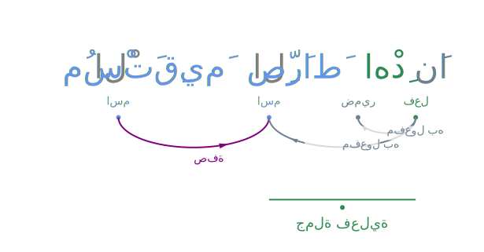
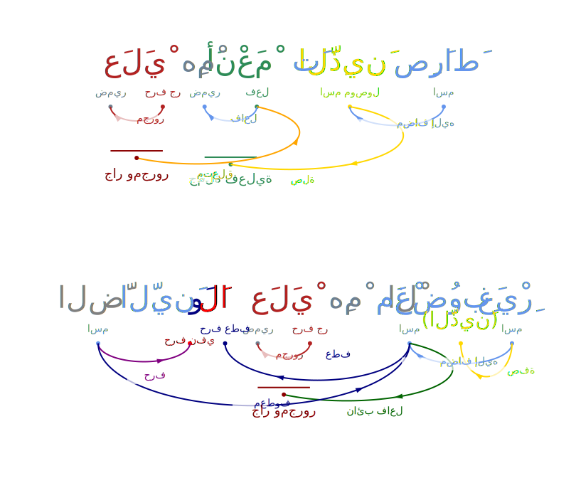

# Dependency Graphs MASAQ

> **⚠️ WARNING: DRAFT WORK**
>
> This repository and its contents are currently in a **DRAFT** state. The code, data, and documentation are subject to change without notice. Use with caution.

**Status: DRAFT**

This repository contains tools to generate dependency graphs for Quranic verses using the MASAQ database.

## Overview

The `generate_dependency_svg.py` script reads Quranic text, morphology, and syntax data from `MASAQ.db` and generates Scalable Vector Graphics (SVG) visualizations of the dependency grammar.

## Usage

1.  **Prerequisites**: Python 3.8+
2.  **Run the script**:

    ```bash
    python3 generate_dependency_svg.py --surah <SURAH_NUMBER> --ayah <AYAH_NUMBER>
    ```

    Example:
    ```bash
    python3 generate_dependency_svg.py --surah 1 --ayah 1
    ```

    This will generate an SVG file in the `output_v2/` directory (created automatically).

3.  **Options**:
    *   `--surah`, `--ayah`: Specify the verse(s) to generate.
    *   `--output`: Specify a custom output path (when using `--spec`).
    *   `--debug`: Enable debug visualization (outlines, overlaps).
    *   `--verbose`: Print detailed logs.

## Sample Output

Here are the generated dependency graphs for Surah Al-Fatiha (Surah 1):

### Ayah 1


### Ayah 2


### Ayah 3


### Ayah 4


### Ayah 5


### Ayah 6


### Ayah 7


## Data Source

This project uses the **MASAQ** dataset.

**Description**:
The Morphologically-Analyzed and Syntactically-Annotated Quran (MASAQ) dataset is a high-quality, annotated resource designed to advance Arabic Natural Language Processing (NLP). Covering the entire Quran, MASAQ includes over 131K morphological and 123K syntactic entries, verified by expert linguists using traditional i'rab methodologies. Available in multiple formats, it supports a range of applications—from teaching Arabic grammar to enhancing NLP tools like parsers and taggers. By enabling precise language analysis, MASAQ fosters advancements in Arabic NLP and cross-linguistic research, licensed under Creative Commons for ethical use.

**Bibliographic Details**:
*   **Title**: MASAQ: Morphologically and Syntactically-Annotated Quran Dataset
*   **Authors**: Majdi Sawalha, Sane Yagi, Faisal Alshargi, Bassam Hammo, Abdallah Alshdaifat
*   **Publisher**: Mendeley Data
*   **DOI**: 10.17632/9yvrzxktmr.6
*   **URL**: [https://data.mendeley.com/datasets/9yvrzxktmr/6](https://data.mendeley.com/datasets/9yvrzxktmr/6)
*   **Citation**:
    > Sawalha, Majdi; Yagi, Sane; Alshargi, Faisal; Hammo, Bassam; Alshdaifat, Abdallah (2024), “MASAQ: Morphologically and Syntactically-Annotated Quran Dataset”, Mendeley Data, V6, doi: 10.17632/9yvrzxktmr.6

## Contributing

This project is currently in **DRAFT** status. We welcome contributions!
*   Found a bug? Please open an Issue.
*   Want to improve the graph layout or logic? Please submit a Pull Request.

## License

This project is licensed under the MIT License - see the [LICENSE](LICENSE) file for details.
The `MASAQ.db` file is subject to its own license terms (CC BY 4.0).
